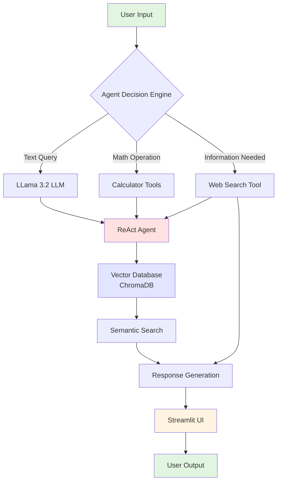
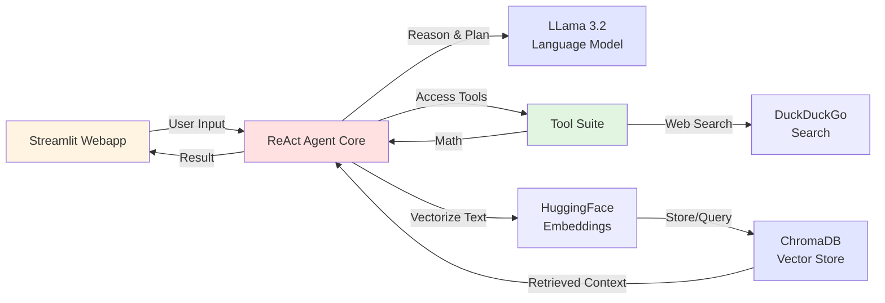
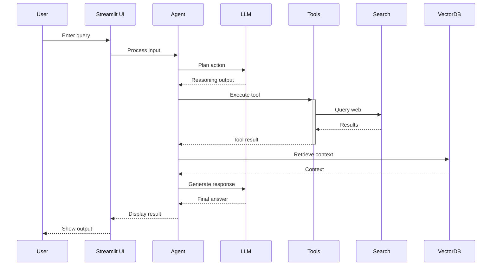
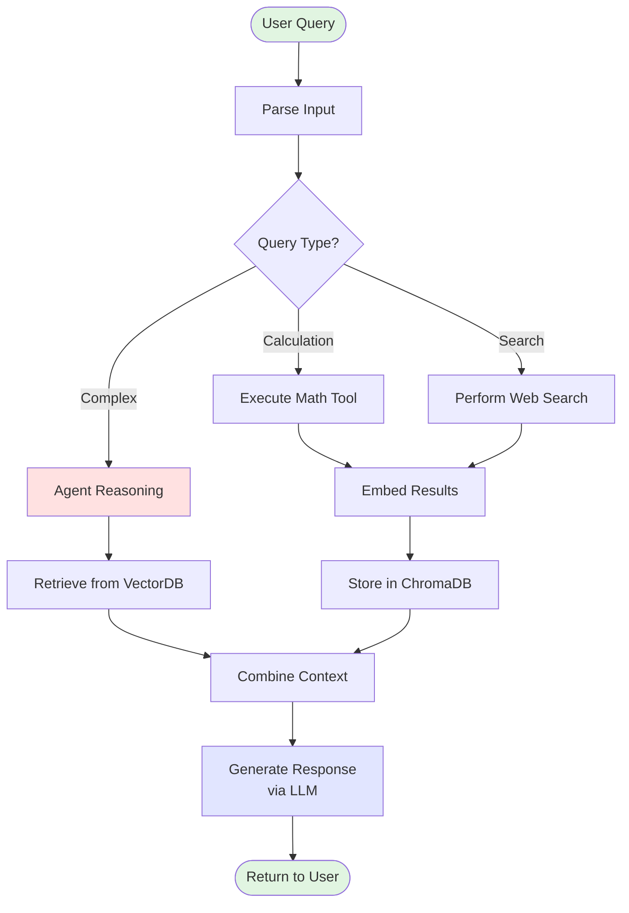

# 🤖 Advanced Agentic AI & Web App Creation

A sophisticated AI-powered agent framework that combines **ReAct reasoning**, **vector embeddings**, and **web search capabilities** with a **Streamlit web interface** for intelligent task automation.

---

## 📋 Table of Contents
- [Overview](#overview)
- [Architecture](#architecture)
- [Features](#features)
- [Project Structure](#project-structure)
- [Installation](#installation)
- [Usage](#usage)
- [Technologies](#technologies)
- [API Reference](#api-reference)

---

## 🎯 Overview

This project implements an advanced agentic AI system that:
- **Reasons through complex tasks** using ReAct (Reasoning + Acting) pattern
- **Retrieves relevant information** via semantic search and web queries
- **Performs calculations** with built-in mathematical tools
- **Provides a user-friendly interface** through Streamlit webapp

Perfect for building intelligent assistants, automation workflows, and decision-support systems.

---

## 🏗️ Architecture

### System Flowchart



### Component Interaction



---

## ✨ Features

| Feature | Description |
|---------|-------------|
| 🧠 **ReAct Agent** | Reasoning + Acting pattern for complex problem-solving |
| 🔍 **Web Search** | Real-time information retrieval via DuckDuckGo |
| 🧮 **Math Tools** | Add, subtract, multiply operations with type safety |
| 📚 **Vector Database** | ChromaDB for semantic search and context retrieval |
| 🤗 **HuggingFace Embeddings** | BAAI/bge-small-en model for semantic understanding |
| 🚀 **Streamlit UI** | Interactive web interface for easy interaction |
| 📄 **Document Processing** | Load and process files with SimpleDirectoryReader |
| ⚡ **Configurable LLM** | Ollama integration with Llama 3.2 model |

---

## 📁 Project Structure

```
Advanced-agentic-AI-and-Web-app-creation/
│
├── agent.py.py              # Core agent implementation with ReAct
├── webapp2.py               # Streamlit web application
├── README.md                # This file
│
└── Dependencies:
    ├── llamaindex          # RAG & agent framework
    ├── chromadb            # Vector database
    ├── streamlit           # Web UI framework
    ├── ollama              # Local LLM engine
    └── duckduckgo-search   # Web search API
```

---

## 📦 Installation

### Prerequisites
- Python 3.9+
- Ollama (for local LLM inference)
- pip package manager

### Setup Steps

```bash
# 1. Clone repository
git clone <repository-url>
cd Advanced-agentic-AI-and-Web-app-creation

# 2. Create virtual environment
python -m venv venv
source venv/bin/activate  # On Windows: venv\Scripts\activate

# 3. Install dependencies
pip install -r requirements.txt

# 4. Install Ollama (https://ollama.ai)
# Download and install Ollama, then pull model:
ollama pull llama3.2

# 5. Start Ollama service
ollama serve
```

### requirements.txt
```
llama-index==0.9.x
chromadb>=0.4.0
streamlit>=1.28.0
duckduckgo-search>=3.9.0
huggingface-hub>=0.18.0
sentence-transformers>=2.2.0
```

---

## 🚀 Usage

### Option 1: Run Agent Script
```bash
python agent.py.py
```

### Option 2: Run Streamlit Web App
```bash
streamlit run webapp2.py
```

### Example Usage Flow



---

## 🛠️ Technologies

| Component | Technology | Purpose |
|-----------|-----------|---------|
| **LLM Framework** | LlamaIndex | RAG & agent orchestration |
| **Language Model** | Llama 3.2 (Ollama) | Local inference |
| **Embeddings** | HuggingFace BGE-Small | Semantic understanding |
| **Vector DB** | ChromaDB | Persistent semantic search |
| **Web Search** | DuckDuckGo API | Real-time information |
| **UI Framework** | Streamlit | Interactive web interface |
| **Language** | Python 3.9+ | Core implementation |

---

## 📚 API Reference

### Core Functions

#### `multiply(a: int, b: int) -> int`
Multiplies two integers and returns the result.
```python
result = multiply(5, 3)  # Returns: 15
```

#### `add(a: int, b: int) -> int`
Adds two integers and returns the result.
```python
result = add(10, 5)  # Returns: 15
```

#### `subtract(a: int, b: int) -> int`
Subtracts the second integer from the first and returns the result.
```python
result = subtract(10, 3)  # Returns: 7
```

#### `search(query: str) -> str`
Searches the web and returns top 3 results.
```python
results = search("Python programming tips")
# Returns concatenated search results as string
```

---

## 🔧 Configuration

Modify settings in the Python files:

```python
# LLM Configuration
Settings.llm = Ollama(model="llama3.2", request_timeout=360.0)

# Embedding Configuration
Settings.embed_model = HuggingFaceEmbedding(
    model_name="BAAI/bge-small-en"
)

# Search Configuration
DDGS(max_results=3)  # Adjust number of search results
```

---

## 📈 Workflow Diagram



---

## 🤝 Contributing

Contributions welcome! Please:
1. Fork the repository
2. Create feature branch (`git checkout -b feature/amazing-feature`)
3. Commit changes (`git commit -m 'Add amazing feature'`)
4. Push to branch (`git push origin feature/amazing-feature`)
5. Open Pull Request

---

## 📝 License

This project is open source and available under the MIT License.

---

